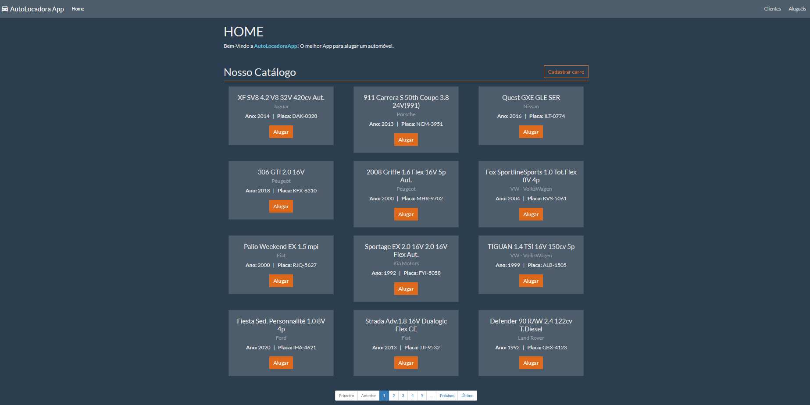
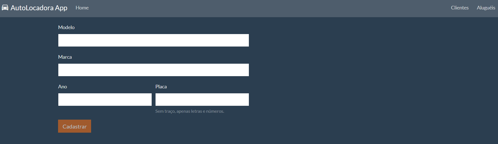
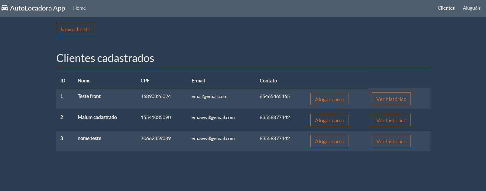
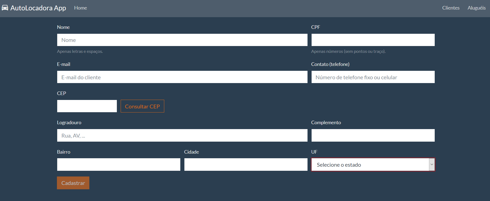
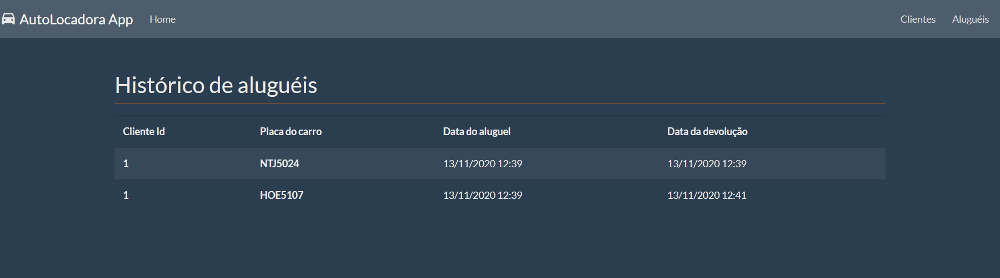
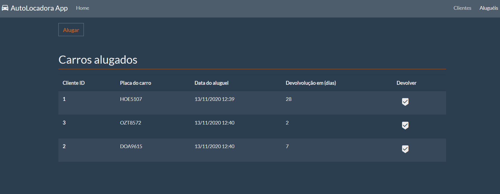
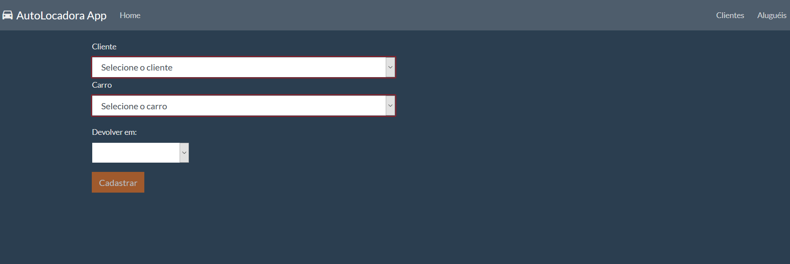

# Front-end

Este é o front-end web do sistema de locação de veículos e as tecnologias utilizadas foram:

- AngularJS
- Grunt
- Jasmine
- Karma

## Iniciando a aplicação

Primeiro é necessário instalar as dependências, usando o comando:
```shell script
npm install
```

Para executar o projeto localmente, use:
```shell script
npm start
```

A aplicação ficará disponível no endereço: `http://localhost:3000`

Para executar os testes de unidade, use:
```shell script
npm run test
```

## Telas do sistema

### Home



### Cadastro de veículo



### Clientes



### Cadastro de cliente



### Histórico de aluguéis do cliente



### Aluguéis



### Aluguel de carro



