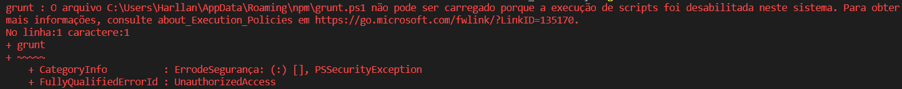

Instalar as dependências: `npm install`

Também tem que instalar o Grunt CLI no modo global: `npm i grunt-cli -g`

Caso ocorra erro ao rodar o comando "grunt" no windows, como na imagem abaixo, deve-se abrir o PowerShell (como administrador) e rodar o comando:
`> set-executionpolicy remotesigned`

